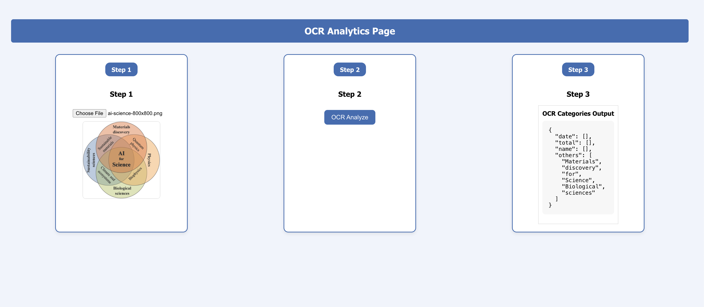
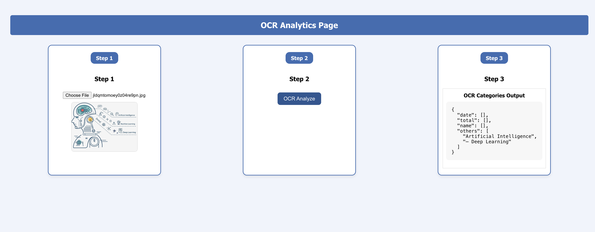

# 📊 OCR Analytics Page (React + Azure Cognitive Services)

A web-based OCR (Optical Character Recognition) Analytics application built with **React.js** and integrated with **Azure Cognitive Services**. This tool allows users to upload images, perform OCR analysis, and view categorized text output in a clean UI.

---

## 🚀 Features

- 📷 Upload image and preview
- 🧠 Perform OCR using Microsoft Azure's Computer Vision API
- 🗃️ Categorize extracted text (e.g., dates, totals, names)
- ⚡ Clean 3-step user interface (Step 1 → Step 2 → Step 3)

---

## 🖼️ Screenshots

### 🔹 Step 1: Upload Image

### 🔹 Step 3: Categorized OCR Output

## 🛠️ Tech Stack

- **Frontend:** React.js (with hooks)
- **AI/OCR API:** Azure Cognitive Services – Computer Vision v3.2
- **Deployment:** (Optional: Vercel / Netlify / Azure Web App)

